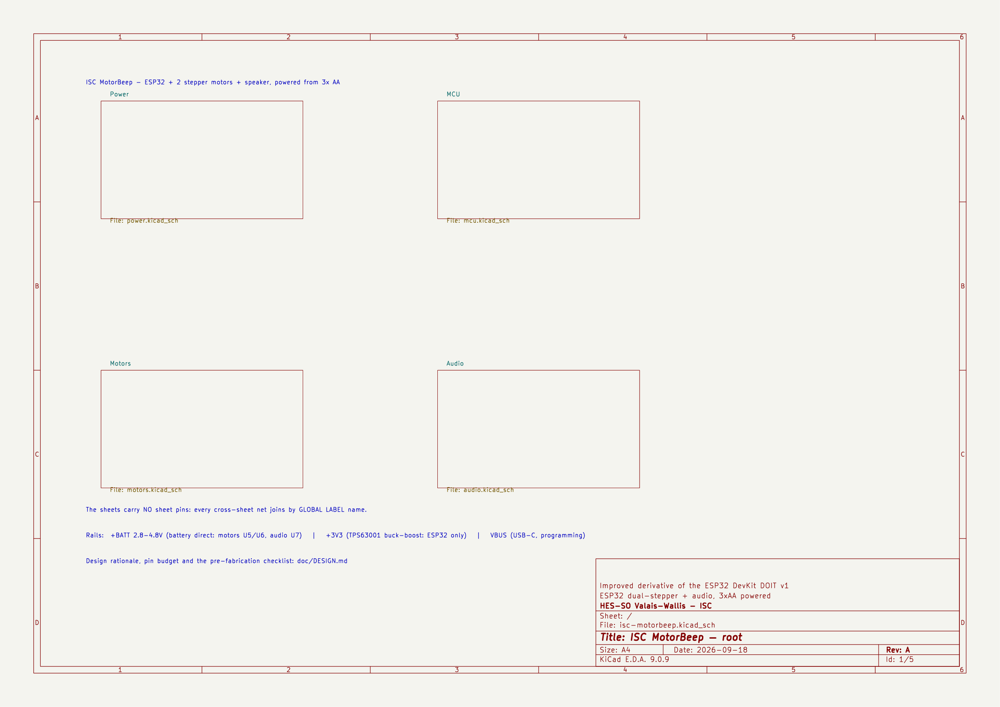
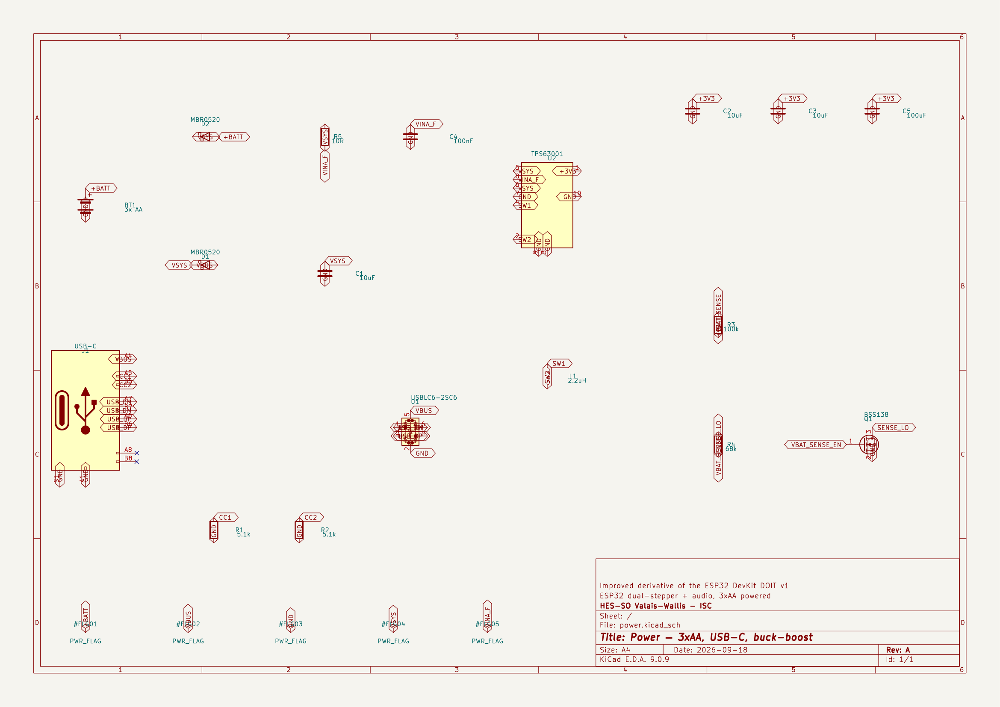
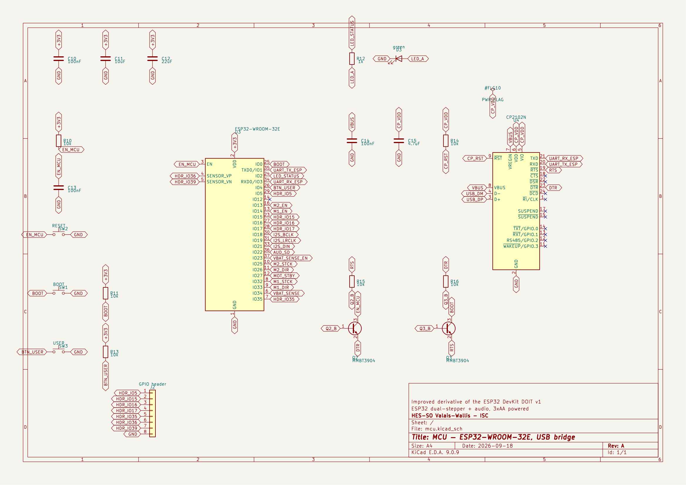
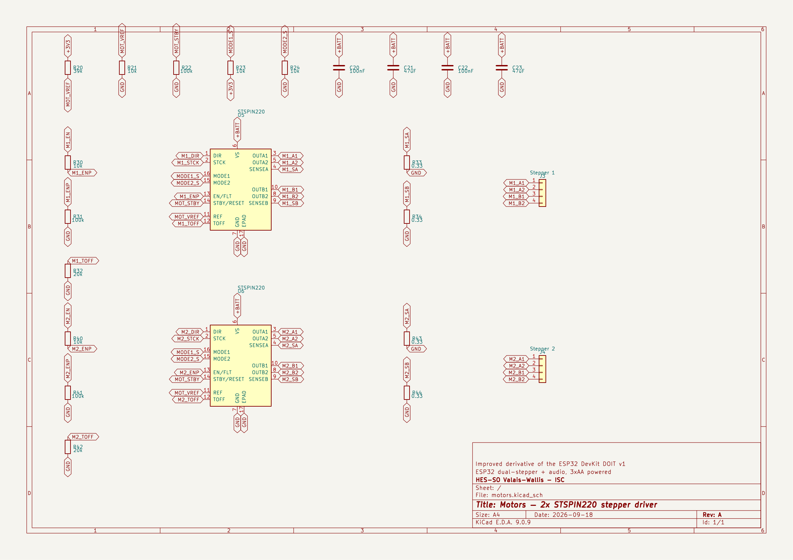
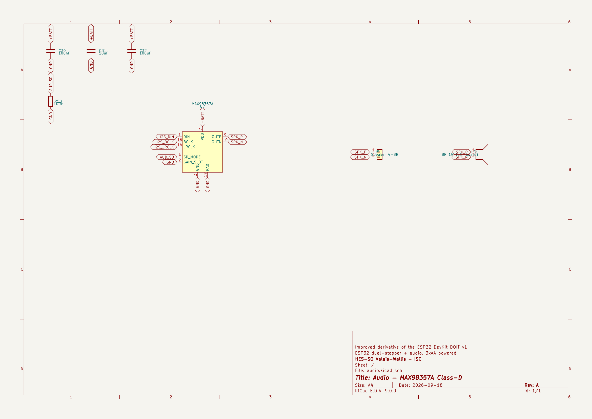
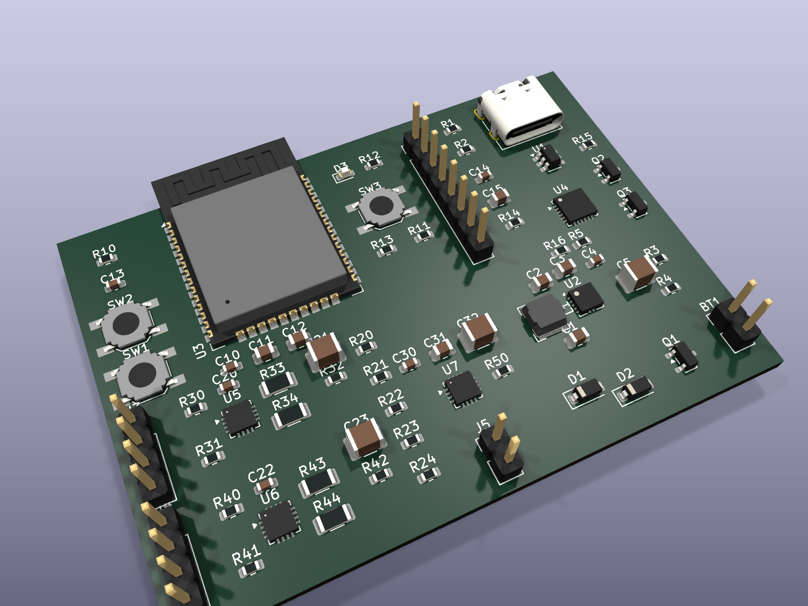
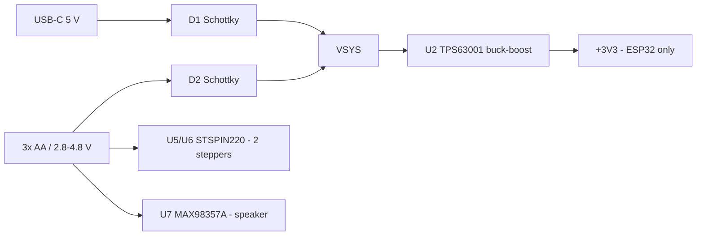

<picture>
  <source media="(prefers-color-scheme: dark)"
          srcset="https://raw.githubusercontent.com/ISC-HEI/isc-logos/main/white/ISC%20Logo%20inline%20white%20v3%20-%20large.webp">
  
</picture>

# ISC MotorBeep — ESP32 dual-stepper + audio board

A complete [KiCad 9](https://www.kicad.org/) schematic for an ESP32 board driving two bipolar
stepper motors and a small speaker, powered from 3× AA cells. It is an improved derivative of the
ESP32 DevKit DOIT v1: the AMS1117 LDO, the thin bulk capacitance, the micro-USB connector and the
absent battery sensing are all addressed.

## The brief

Take the [ESP32 DevKit DOIT v1](https://embedded-systems-design.github.io/overview-of-the-esp32-devkit-doit-v1/)
as the reference design and produce an improved version of it that drives **two stepper motors** and
a **small speaker**, running off **AA cells** — originally two, changed to three during the work.
Deliver the complete schematic in KiCad (installing it as needed), authored through the
[KiCAD-MCP-Server](https://github.com/mixelpixx/KiCAD-MCP-Server).

## What was built

1. KiCad 9 installed, the MCP server built, and patched — it emits the KiCad 10 file format, which 9 refuses to load.
2. Architecture chosen from the battery up: 3× AA (2.8–4.8 V) sits inside the STSPIN220 and MAX98357A supply windows, so motors and audio need no converter; only the ESP32 does, and it must be a buck-boost.
3. Parts picked against what KiCad actually ships — `DRV8834` and `TPS63020` have no stock symbols, so `STSPIN220` and `TPS63001` replaced them.
4. Four hierarchical sheets authored headlessly: power, MCU, motors, audio. **Root ERC: 0 errors.**
5. Verified three ways — ERC, a rendered image of every sheet reviewed by eye, and `check_nets.py`, which asserts 29 design-intent connections against the exported netlist.
6. Footprints assigned and checked to exist, netlist and PDF exported, BOM priced against the real JLCPCB catalog (**$14.49**, part links in [`doc/BOM.md`](./doc/BOM.md)).
7. A 4-layer PCB created and fully placed — antenna overhanging the edge, switching nodes 4.3 mm — then rendered in 3D. **Routing was not done.**

## Schematic

Four hierarchical sheets plus a root. Click any image for full resolution, or read
[the complete PDF](./doc/isc-motorbeep-schematic.pdf).

### Root — sheet hierarchy

[](./doc/render/root.png)

### Power — 3× AA, Schottky OR, TPS63001 buck-boost, USB-C

[](./doc/render/power.png)

### MCU — ESP32-WROOM-32E, CP2102N bridge, auto-reset

[](./doc/render/mcu.png)

### Motors — 2× STSPIN220 stepper drivers

[](./doc/render/motors.png)

### Audio — MAX98357A Class-D

[](./doc/render/audio.png)

## PCB

Placed, not routed. 70 x 50 mm, 4 layers, 69 footprints, verified by
[`tools/place_board.py`](./tools/place_board.py): no overlaps, nothing off-board, and nothing
inside the ESP32 antenna keepout. The module's antenna deliberately overhangs the top edge, and
L1 sits directly left of the TPS63001 so both switching nodes come out as 4.3 mm straight runs.

[](./doc/render/pcb-3d-iso.png)

Routing is not done, so there are no tracks and no copper pours yet.

## Architecture

Three AA cells deliver 2.8–4.8 V, and that range sits inside the supply window of both power loads —
the STSPIN220 works from 1.8 V and the MAX98357A from 2.5 V — so the motors and the speaker run
straight off the pack with no converter at all. Only the ESP32 needs one, and it has to be a
buck-boost: the pack starts above 3.3 V and ends below it, so an LDO would drop out and a plain
boost could not regulate down. USB and battery are OR'd through two Schottky diodes into that
converter only, which is what stops USB from back-feeding and charging the alkaline cells.



Every line the ESP32 gates has a resistor defining its state at reset, so the motors cannot twitch
and the speaker cannot pop at power-up; `GPIO12` is left unconnected because it straps the flash
voltage. The reasoning, the full pin budget and the pre-fabrication checklist are in
**[`doc/DESIGN.md`](./doc/DESIGN.md)**.

## Bill of materials

70 components in 36 lines, about **$14.49** in parts at 1-off LCSC prices (catalog snapshot of
14 September 2026). Full priced BOM with a part link per line: **[`doc/BOM.md`](./doc/BOM.md)**.

> [!WARNING]
> **The STSPIN220 was down to 27 units at JLCPCB in that snapshot** — check it live before
> committing to a build. `doc/BOM.md` names the substitute and what swapping costs you.

Almost every part is a JLCPCB *Extended* part with a $3 setup fee each, so for a one-off, hand
assembly is cheaper than paying the setup fees.

## Open it

```bash
kicad hardware/isc-motorbeep/isc-motorbeep.kicad_pro
```

Generated headlessly through the KiCAD-MCP-Server — reproduction steps, the KiCad 9 file-format
patch it needs, and the helper scripts are in [`doc/TOOLING.md`](./doc/TOOLING.md).

## Before fabricating

The schematic is complete and ERC-clean, but two questions could not be settled without
manufacturer datasheets. Both are detailed, with the rest of the checklist, in
[`doc/DESIGN.md` §8.5–8.6](./doc/DESIGN.md):

- **Are the STSPIN220 and MAX98357A logic inputs rated independently of their supply?** The ESP32
  drives 3.3 V into them while `+BATT` may be at 2.8 V. If either is VS-referenced, the design
  breaks at low battery. This is the one that matters.
- **The QFN-16 exposed-pad dimension** for U5/U6/U7 — stock footprint variants run 1.45 to 1.85 mm,
  and it is the thermal path the current-chopping depends on.

---

## License

Copyright © 2026 P.-A. Mudry / ISC — HES-SO Valais. Released under
[CC-BY-NC-ND 4.0](https://creativecommons.org/licenses/by-nc-nd/4.0/).

---

*Made with ♥ by mui, 2026*
