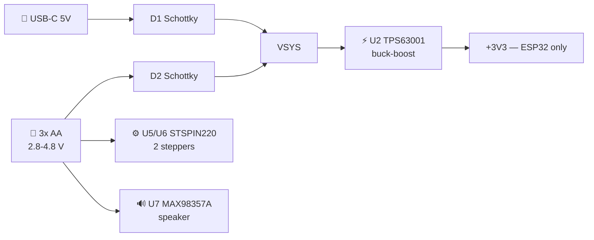
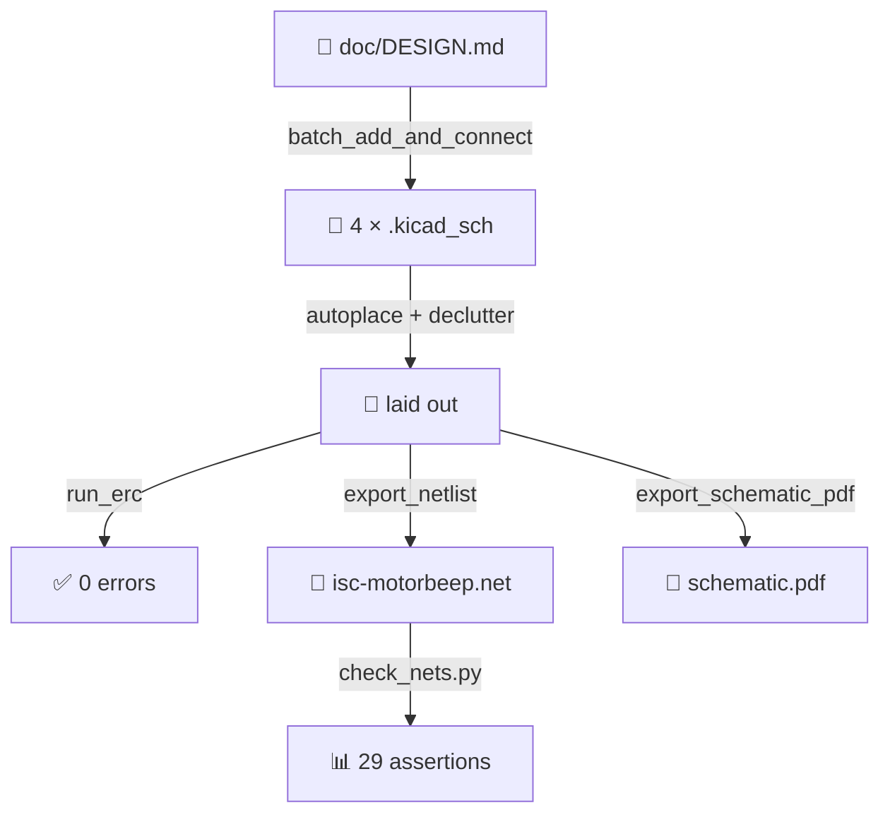

<picture>
  <source media="(prefers-color-scheme: dark)"
          srcset="https://raw.githubusercontent.com/ISC-HEI/isc-logos/main/white/ISC%20Logo%20inline%20white%20v3%20-%20large.webp">
  
</picture>

# ISC MotorBeep — ESP32 dual-stepper + audio board

A complete [KiCad 9](https://www.kicad.org/) schematic for an ESP32 board driving **two bipolar
stepper motors** and a **small speaker**, powered from **3× AA cells**. It is an improved derivative
of the ESP32 DevKit DOIT v1: the AMS1117 LDO, the thin bulk capacitance, the micro-USB connector and
the absent battery sensing are all addressed.

The whole schematic was authored **headlessly** — no GUI, not one mouse click — by driving the
[KiCAD-MCP-Server](https://github.com/mixelpixx/KiCAD-MCP-Server) from an AI agent. It passes **ERC
with 0 errors**, and a netlist assertion script re-checks all 29 design-intent connections on demand.

## Schematic

Four hierarchical sheets plus a root. Click any image for full resolution, or read
**[the complete PDF](./doc/isc-motorbeep-schematic.pdf)** (5 pages).

### Root — sheet hierarchy

[](./doc/render/root.png)

### Power — 3× AA, Schottky OR, TPS63001 buck-boost, USB-C

[](./doc/render/power.png)

### MCU — ESP32-WROOM-32E, CP2102N bridge, auto-reset

[](./doc/render/mcu.png)

### Motors — 2× STSPIN220 stepper drivers

[](./doc/render/motors.png)

### Audio — MAX98357A Class-D

[](./doc/render/audio.png)

> [!NOTE]
> The sheets carry **no sheet pins**: every cross-sheet net joins by *global label* name. That is a
> normal KiCad hierarchy convention, and it is what makes the design safe to generate programmatically.

## How the design works

### 3× AA is what removes an entire converter

This is the decision everything else follows from. The pack delivers 2.8–4.8 V, and that range sits
**inside** the supply window of both power loads:

| Part | Supply range | Fed from |
|---|---|---|
| STSPIN220 (steppers) | 1.8 – 10 V | `+BATT` **directly** |
| MAX98357A (audio) | 2.5 – 5.5 V | `+BATT` **directly** |
| ESP32-WROOM-32E | 3.0 – 3.6 V | `+3V3` via TPS63001 |

So motors and audio need **no converter at all** — fewer parts, less EMI, and no conversion loss on
the largest load. Only the logic rail needs one, and it must be a **buck-boost**: the pack starts at
4.8 V (above 3.3) and ends at 2.8 V (below it), so an LDO would drop out and a plain boost could not
regulate down. With 2× AA this was not possible — a 5 V boost was mandatory for the motors.



### The USB back-feed trap, avoided

The obvious way to OR two supplies is a P-MOSFET "ideal diode". It is wrong here: once the FET turns
on it conducts **both ways**, so VBUS at 5 V would push current straight back into the pack —
charging alkaline cells is a leak-and-rupture hazard. Two Schottky diodes cannot do that. The OR
node also feeds **only** the 3.3 V converter, so a 500 mA USB port is never asked to drive two
stepper motors.

### Everything the ESP32 gates is default-safe

At reset every ESP32 GPIO is high-Z. Each gated line therefore has a resistor that defines the safe
state, so the motors cannot twitch and the speaker cannot pop at power-up:

| Net | Pull | Effect at reset |
|---|---|---|
| `MOT_STBY` → both STSPIN220 `STBY` | 100 k **down** | drivers in standby, coils unpowered |
| `M1_EN` / `M2_EN` → `EN/FLT` | 100 k **down** + 10 k series | outputs disabled; the open-drain fault can still pull low |
| `AUD_SD` → `SD_MODE` | 100 k **down** | amplifier muted |

`GPIO12` (MTDI) is deliberately left **unconnected** — anything on it risks strapping the wrong
flash voltage. The netlist test asserts that it stays that way.

### What is improved over the DOIT DevKit v1

| DOIT v1 weakness | Fix here |
|---|---|
| AMS1117 LDO — ~1.1 V dropout, no low-power mode | TPS63001 buck-boost; motors/audio need no converter |
| Thin bulk capacitance → brownout on WiFi TX bursts | 22 µF + 10 µF + 100 nF at the module, 100 µF reservoir on `+3V3` |
| Micro-USB, no ESD protection | USB-C + USBLC6-2SC6 ESD array |
| No reverse-polarity protection | Schottky in the battery leg |
| No battery sensing | divider on an **ADC1** pin, MOSFET-gated so it draws nothing when idle |
| ADC2 unusable while WiFi is on (silent trap) | all analog on ADC1 only |
| Strapping pins exposed with no guidance | GPIO0/2/15 kept clear, GPIO12 left NC |

Full reasoning, pin budget and the pre-fabrication checklist: **[`doc/DESIGN.md`](./doc/DESIGN.md)**.

## Bill of materials and cost

70 components in 36 lines. Prices below are **real LCSC/JLCPCB figures**, not estimates — every row
links to its part page, and the whole table is regenerated by
[`tools/price_bom.py`](./tools/price_bom.py) against the server's offline JLCPCB catalog
(snapshot dated **14 September 2026**, 633 249 parts):

```bash
tools/kicad-mcp-server/.venv/bin/python tools/price_bom.py
```

| Ref | Value | Package | LCSC | Qty | Unit $ | Line $ | Stock |
|---|---|---|---|---:|---:|---:|---:|
| `BT1` | 3x AA | PinHeader_1x02_P2.54mm_Vertical | [C115246](https://jlcpcb.com/partdetail/115246) | 1 | 0.2166 | **0.22** | 2,949 |
| `C1-C3,C11,C31` | 10uF | C_0805_2012Metric | [C109040](https://jlcpcb.com/partdetail/109040) | 5 | 0.1089 | **0.54** | 6,534 |
| `C4,C10,C13,C14,C20,C22,C30` | 100nF | C_0603_1608Metric | [C113803](https://jlcpcb.com/partdetail/113803) | 7 | 0.0129 | **0.09** | 22,292 |
| `C5,C32` | 100uF | C_1210_3225Metric | [C16196526](https://jlcpcb.com/partdetail/16196526) | 2 | 0.7412 | **1.48** | 1,323 |
| `C12` | 22uF | C_0805_2012Metric | [C128856](https://jlcpcb.com/partdetail/128856) | 1 | 0.0928 | **0.09** | 20,058 |
| `C15` | 4.7uF | C_0805_2012Metric | [C106839](https://jlcpcb.com/partdetail/106839) | 1 | 0.0479 | **0.05** | 1,067 |
| `C21,C23` | 47uF | C_1210_3225Metric | [C16196538](https://jlcpcb.com/partdetail/16196538) | 2 | 0.2780 | **0.56** | 961 |
| `D1,D2` | MBR0520 | D_SOD-123 | [C22378360](https://jlcpcb.com/partdetail/22378360) | 2 | 0.0146 | **0.03** | 10,217 |
| `D3` | green | LED_0603_1608Metric | [C125102](https://jlcpcb.com/partdetail/125102) | 1 | 0.0166 | **0.02** | 109,618 |
| `J1` | USB-C | USB_C_Receptacle_G-Switch_GT-USB-7010ASV | [C165948](https://jlcpcb.com/partdetail/165948) | 1 | 0.1858 | **0.19** | 89,797 |
| `J2` | GPIO header | PinHeader_1x08_P2.54mm_Vertical | [C115246](https://jlcpcb.com/partdetail/115246) | 1 | — | *(same strip)* | 2,949 |
| `J3` | Stepper 1 | PinHeader_1x04_P2.54mm_Vertical | [C115246](https://jlcpcb.com/partdetail/115246) | 1 | — | *(same strip)* | 2,949 |
| `J4` | Stepper 2 | PinHeader_1x04_P2.54mm_Vertical | [C115246](https://jlcpcb.com/partdetail/115246) | 1 | — | *(same strip)* | 2,949 |
| `J5` | Speaker 4-8R | PinHeader_1x02_P2.54mm_Vertical | [C115246](https://jlcpcb.com/partdetail/115246) | 1 | — | *(same strip)* | 2,949 |
| `L1` | 2.2uH | L_Bourns-SRN4018 | [C107565](https://jlcpcb.com/partdetail/107565) | 1 | 0.0798 | **0.08** | 1,102 |
| `LS1` | 8R 1W (off-board) | — | — | 1 | — | — | — |
| `Q1` | BSS138 | SOT-23 | [C112239](https://jlcpcb.com/partdetail/112239) | 1 | 0.0176 | **0.02** | 271,091 |
| `Q2,Q3` | MMBT3904 | SOT-23 | [C22368849](https://jlcpcb.com/partdetail/22368849) | 2 | 0.0064 | **0.01** | 606 |
| `R1,R2` | 5.1k | R_0603_1608Metric | [C105580](https://jlcpcb.com/partdetail/105580) | 2 | 0.0020 | **0.00** | 5,622 |
| `R3,R22,R31,R41,R50` | 100k | R_0603_1608Metric | [C103200](https://jlcpcb.com/partdetail/103200) | 5 | 0.0014 | **0.01** | 517 |
| `R4` | 68k | R_0603_1608Metric | [C103818](https://jlcpcb.com/partdetail/103818) | 1 | 0.0010 | **0.00** | 725 |
| `R5` | 10R | R_0603_1608Metric | [C4297800](https://jlcpcb.com/partdetail/4297800) | 1 | 0.0026 | **0.00** | 5,241 |
| `R10,R11,R13-R16,R21,R23,R24,R30,R40` | 10k | R_0603_1608Metric | [C130232](https://jlcpcb.com/partdetail/130232) | 11 | 0.0038 | **0.04** | 1,192 |
| `R12` | 1k | R_0603_1608Metric | [C100835](https://jlcpcb.com/partdetail/100835) | 1 | 0.0012 | **0.00** | 2,564 |
| `R20` | 39k | R_0603_1608Metric | [C118370](https://jlcpcb.com/partdetail/118370) | 1 | 0.0006 | **0.00** | 4,415 |
| `R32,R42` | 20k | R_0603_1608Metric | [C101298](https://jlcpcb.com/partdetail/101298) | 2 | 0.0012 | **0.00** | 1,157 |
| `R33,R34,R43,R44` | 0.33 | R_1206_3216Metric | [C104942](https://jlcpcb.com/partdetail/104942) | 4 | 0.0079 | **0.03** | 4,803 |
| `SW1` | BOOT | SW_SPST_SKQG_WithoutStem | [C10852](https://jlcpcb.com/partdetail/10852) | 1 | 0.0225 | **0.02** | 892 |
| `SW2` | RESET | SW_SPST_SKQG_WithoutStem | [C10852](https://jlcpcb.com/partdetail/10852) | 1 | 0.0225 | **0.02** | 892 |
| `SW3` | USER | SW_SPST_SKQG_WithoutStem | [C10852](https://jlcpcb.com/partdetail/10852) | 1 | 0.0225 | **0.02** | 892 |
| `U1` | USBLC6-2SC6 | SOT-23-6 | [C47147619](https://jlcpcb.com/partdetail/47147619) | 1 | 0.0323 | **0.03** | 6,309 |
| `U2` | TPS63001 | Texas_DRC0010J_ThermalVias | [C28060](https://jlcpcb.com/partdetail/28060) | 1 | 1.7929 | **1.79** | 6,715 |
| `U3` | ESP32-WROOM-32E | ESP32-WROOM-32E | [C701341](https://jlcpcb.com/partdetail/701341) | 1 | 3.8183 | **3.82** | 20,082 |
| `U4` | CP2102N | QFN-24-1EP_4x4mm_P0.5mm_EP2.15x2.15mm | [C964632](https://jlcpcb.com/partdetail/964632) | 1 | 1.8059 | **1.81** | 14,927 |
| `U5,U6` | STSPIN220 | QFN-16-1EP_3x3mm_P0.5mm_EP1.45x1.45mm_ThermalVias | [C2150516](https://jlcpcb.com/partdetail/2150516) | 2 | 1.5033 | **3.01** | 27 |
| `U7` | MAX98357A | QFN-16-1EP_3x3mm_P0.5mm_EP1.45x1.45mm_ThermalVias | [C2682619](https://jlcpcb.com/partdetail/2682619) | 1 | 0.4995 | **0.50** | 16,467 |

**Total: $14.49 in parts for one board**, at 1-off price breaks.

That is parts only — no PCB, no assembly, no shipping. If you use JLCPCB assembly, note that almost
every part here is an *Extended* part, which carries a **$3 setup fee each**; for a one-off build
that dwarfs the component cost, so hand-assembly or a small hot-plate reflow is the sane route for
a prototype.

### Sourcing notes — read before ordering

> [!WARNING]
> **The STSPIN220 is nearly out of stock: 27 units at JLCPCB.** It is the part the whole low-voltage
> architecture rests on, and it is the one thing here you cannot simply substitute — check
> availability *before* committing to a build.

If it is gone, the closest replacement is the **DRV8834** (`C400392`, VQFN-24, **721 in stock**, or
`C456273` HTSSOP-24, 2 185 in stock, ~$2.40). Its supply range is 2.5–10.8 V, which still covers a
3× AA pack for its whole useful life (practical cutoff 2.8 V alkaline / 3.0 V NiMH) — but it is
*not* a footprint-compatible swap, and KiCad 9 ships **no** DRV8834 symbol, so the motors sheet
would need a custom symbol and footprint. That is why the design ships with the STSPIN220, whose
1.8 V floor also leaves far more margin.

Two smaller notes: `LS1` is the off-board speaker and is unpriced on purpose — `J5` is the connector
that is actually on the board. All five 2.54 mm headers are cut from a **single 1×40 strip**
(20 pins used of 40), so the strip is counted once rather than five times.


## Quick Start

```bash
# Open the project in the KiCad GUI
kicad hardware/isc-motorbeep/isc-motorbeep.kicad_pro

# Or re-run the checks headlessly
kicad-cli sch erc hardware/isc-motorbeep/isc-motorbeep.kicad_sch --output /tmp/erc.rpt
tools/kicad-mcp-server/.venv/bin/python tools/check_nets.py   # 29 net assertions

# Re-render a sheet to doc/render/ (SVG + PNG) and print its ERC
tools/render.sh power
```

## How it was generated

The schematic is generated, not drawn. `tools/kmcp.mjs` speaks MCP over stdio to the server, which
drives KiCad's own Python and `kicad-cli`:

1. **`kmcp.mjs`** — minimal stdio MCP client (`list` / `schema` / `call` / `batch`), waits out the server's Python warm-up
2. **`tools/pins.py`** — prints a library symbol's pins, resolving `(extends …)`, so nets are wired against real pin numbers
3. **`tools/place.py`** — emits move batches with every origin snapped to the 2.54 mm connection grid
4. **`tools/check_nets.py`** — parses the exported netlist and asserts each design-intent net reaches the pins it should



Three traps worth knowing if you reproduce this:

- **Off-grid origins break ERC.** Placing parts on round millimetre coordinates puts their pins off the 2.54 mm connection grid; KiCad then reports *"Symbol pin or wire end off connection grid"* for every one. `tools/place.py` snaps origins so this cannot happen.
- **Per-sheet ERC is not the real ERC.** Cross-sheet global labels look dangling on their own sheet. Only `run_erc` on the **root** is meaningful.
- **"Connected N pins" is not verification.** The server reports success for labels it placed, not for a netlist KiCad agrees with. `tools/check_nets.py` closes that gap.

## Dependencies

| Tool | Required for | Linux (Debian/Ubuntu) | macOS (Homebrew) |
| --- | --- | --- | --- |
| **KiCad 9** | `pcbnew`, `kicad-cli`, symbol + footprint libraries | `sudo add-apt-repository ppa:kicad/kicad-9.0-releases && sudo apt install kicad` | `brew install --cask kicad` |
| **Node.js ≥ 18** | the MCP server and `kmcp.mjs` | `sudo apt install nodejs npm` | `brew install node` |
| **Python ≥ 3.11** | `kicad-skip`, `sexpdata`, `pymupdf` | `sudo apt install python3 python3-venv` | `brew install python` |

> [!IMPORTANT]
> The MCP server writes the KiCad **10** file format (`version 20260101`), which KiCad 9 refuses to
> load — with no better diagnostic than `Failed to load schematic`. The cause is narrow and the fix
> is three lines: see **[`doc/KICAD9-PATCH.md`](./doc/KICAD9-PATCH.md)**. Re-apply it after pulling
> the server upstream.

`.mcp.json` registers the server for Claude Code and contains **absolute paths** — adjust them to
wherever you cloned the server.

## Before anyone fabricates this

The schematic is complete and ERC-clean, but these could not be settled without manufacturer
datasheets and are listed in full in [`doc/DESIGN.md` §8.5–8.6](./doc/DESIGN.md):

- **Most consequential** — are the STSPIN220 and MAX98357A logic inputs rated independently of their supply? The ESP32 drives 3.3 V into them while `+BATT` may be at 2.8 V. If either is VS-referenced, the design breaks at low battery.
- STSPIN220 `REF` → phase-current gain, and the `TOFF` resistor value.
- QFN-16 exposed-pad dimension for U5/U6/U7 — stock variants run 1.45 to 1.85 mm, and it is the thermal path.
- **USB-C J1** — no stock footprint matches the 16P symbol one-to-one (all 26 were checked). The duplicated VBUS/GND pads must be tied by hand, or move to the 24P symbol + footprint.

## Adding a sheet

1. `create_hierarchical_subsheet` against `isc-motorbeep.kicad_sch` — creates the file and links it.
2. Add parts with `batch_add_and_connect` and `labelType: "global_label"`; cross-sheet nets join by name.
3. Snap origins to 2.54 mm (`tools/place.py`), then `autoplace_schematic_fields` + `suggest_schematic_declutter`.
4. `run_erc` on the **root**.
5. Add the sheet's nets to `tools/check_nets.py`, render it, and look at the PNG.

---

## License

Copyright © 2026 P.-A. Mudry / ISC — HES-SO Valais. Released under
[CC-BY-NC-ND 4.0](https://creativecommons.org/licenses/by-nc-nd/4.0/), the ISC default for teaching
material — change it if this design is meant to be built on rather than read.

---

*Made with ♥ by mui, 2026*
